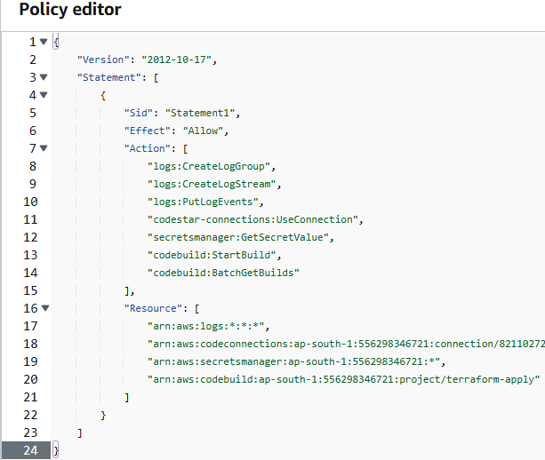

# Automating Infrastructure building using terraform and aws developer tools

## Step:1 Initializing a git repository in local machine

## Step:2 Creating a repository in github.

## step:3 Creating files in local repository that defines infra.

Create a main.tf file which defines the required infrastructure to be build.
In my case I am building an EC2 instance with latest version of amazon linux in a private subnet and attaching security group which I am going to create in further steps.
Create build-spec.yml file which defines installing terraform and execute its commands.
This will destroy the previous build and create the new Infra.
I recommend to change it according to your requirement.
Create a backend.tf file which defined what storage is used to store the current terraform state.

## Step:4 Create a AWS S3 bucket using your account.

Make sure you give the bucket name unique and same name mentioned in backend.tf file and also make sure you enabled bucket versioning.

## Step:5 Create a AWS VPC and a new security group in it.

Create it as per you requirement I created private and public subnets in 2 Availability zones each having around 4000 IP ranges.

## Step:6 Create an IAM role.
Its considered to most crucial and should be done with atmost care.
Attach EC2 access, S3 access, IAM access, cloudwatchevents access policies to the role and create an inline policy like below.

## Step:7 Create a connection to your Github repo from aws developer tools.

Navigate to aws developer tools --> Setting --> Connections
Create a connestion to your github repo by providing required authentication.

## Step:8 Create a code pipeline.

Create a code pipline by giving the connection you created as source and create the build that uses the build-spec.yml file in the repo.
Make sure you web hook it that runs the pipeline for every push in the main brach.
